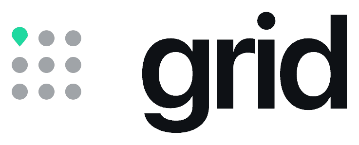
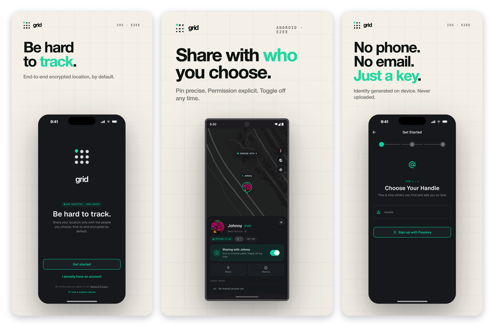

<div align="center">
  <picture>
    <source media="(prefers-color-scheme: dark)" srcset=".github/readme/grid-logo-dark.png">
    <source media="(prefers-color-scheme: light)" srcset=".github/readme/grid-logo-light.png">
    
  </picture>

  <h3>Be Hard to Track.</h3>

  <a href="https://www.mygrid.app">mygrid.app</a>
</div>

<br/>

<div align="center">
  <a href="https://apps.apple.com/app/id6736839927"></a>
  &nbsp;
  <a href="https://play.google.com/store/apps/details?id=app.mygrid.grid"></a>
  &nbsp;
  <a href="https://discord.gg/cJrQXMn6Hk"></a>
</div>

<br/>

<div align="center">
  <a href="https://github.com/Rezivure/Grid-Mobile/stargazers"></a>
  <a href="https://github.com/Rezivure/Grid-Mobile/blob/main/LICENSE"></a>
  
  
  
</div>

<br/>

***Grid*** is a secure, end-to-end encrypted (E2EE) location sharing application integrated with the Matrix Protocol. Built using Flutter, Grid provides a privacy-focused solution for sharing your location with trusted contacts.

<div align="center">
  <picture>
    <source media="(prefers-color-scheme: dark)" srcset=".github/readme/grid-screens-dark.png">
    <source media="(prefers-color-scheme: light)" srcset=".github/readme/grid-screens-light.png">
    
  </picture>
</div>

## Features

|  |  |
|---|---|
| 🔒 **End-to-end encrypted** | Location data is encrypted on your device. The server stores ciphertext it cannot read. |
| 🌐 **Built on Matrix** | Secure, decentralized transport and storage over the Matrix protocol. |
| 📍 **Real-time sharing** | Share live location with a person or a group, and revoke it at any time. |
| 🎛️ **Fine-grained control** | You choose who sees you, and for how long. Toggle sharing off whenever you want. |
| 📱 **iOS and Android** | One Flutter codebase, native builds for both platforms. |
| 🏠 **Self-hostable** | Run your own backend server and map tile provider for complete control. |

## Community

Join our [Discord](https://discord.gg/cJrQXMn6Hk) to submit feature requests, vote on new features, report bugs, get help, and connect with the community & developers!

## Support Grid

Grid is free, open source, and funded by the people who use it. If it is useful to you, you can help keep the servers running:

<a href="https://www.buymeacoffee.com/rezivure"></a>

## Self Hosting

This repository is for the Grid: Private Location Sharing mobile application (iOS/Android). If you are looking to self host a server for the app, check out our [docs](https://docs.mygrid.app/) or join our Discord!

## Getting Started With the App

If you wish to develop/contribute PRs to application, follow the steps below:

### Prerequisites

Before you begin, ensure you have the following installed:

- **Flutter SDK**: [Install Flutter](https://flutter.dev/docs/get-started/install)
- **Android Studio**: [Download Android Studio](https://developer.android.com/studio)
- **Xcode** (for iOS development): [Install Xcode](https://developer.apple.com/xcode/)
- **CocoaPods** (for iOS): [Install CocoaPods](https://guides.cocoapods.org/using/getting-started.html)

### Installation

```bash
git clone https://github.com/Rezivure/Grid-Mobile.git
cd Grid-Mobile
flutter pub get
cp .env.example .env      # then edit .env with your API and server URLs
```

<details>
<summary><b>Platform-specific setup</b></summary>

<br/>

**iOS** — install the CocoaPods dependencies:

```bash
cd ios
pod install
cd ..
```

**Android** — no additional setup is required.

</details>

<details>
<summary><b>Running the app</b></summary>

<br/>

1. Open the cloned repository in Android Studio and make sure your Flutter SDK is configured.
2. Create an Android Emulator or connect a physical device, and confirm it is detected.
3. Build and run:

   ```bash
   flutter run
   ```

</details>

## Project Structure

- **lib/**: Contains the main Flutter application code.
- **assets/**: Stores images, icons, and other assets.
- **pubspec.yaml**: Defines the dependencies and assets for the project.

## Contributing

We welcome contributions! To do so, please reference our Contribution Guidelines [here](https://docs.mygrid.app/docs/category/contributing-to-grid)!

## License

This project is licensed under the GNU Affero General Public License v3.0 - see the [LICENSE](./LICENSE) file for details.

<div align="center">
  <br/>
  <a href="https://www.mygrid.app">Website</a>
  &nbsp;·&nbsp;
  <a href="https://docs.mygrid.app/">Docs</a>
  &nbsp;·&nbsp;
  <a href="https://discord.gg/cJrQXMn6Hk">Discord</a>
  &nbsp;·&nbsp;
  <a href="https://apps.apple.com/app/id6736839927">App Store</a>
  &nbsp;·&nbsp;
  <a href="https://play.google.com/store/apps/details?id=app.mygrid.grid">Google Play</a>
</div>
